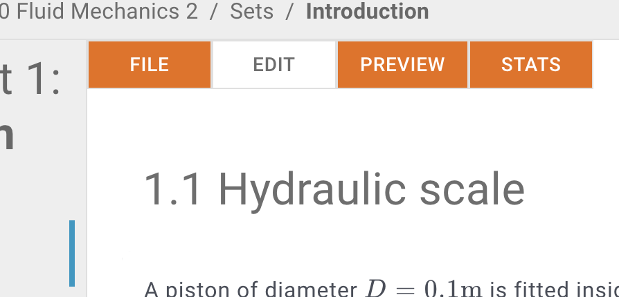
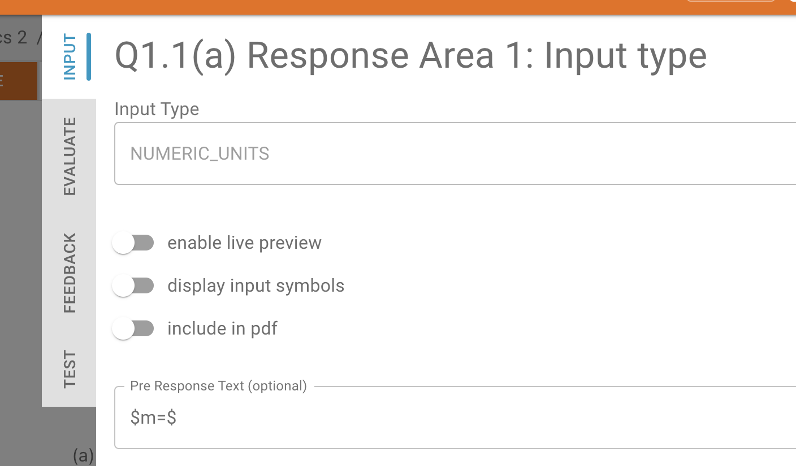
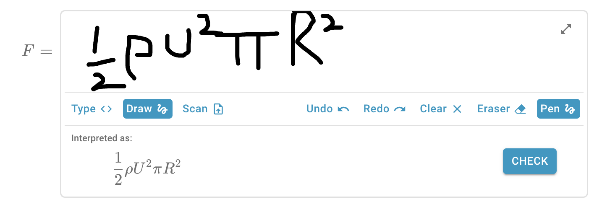

# Releases

## Release 2023/06/22

- b39-new-editor-menus - question editor area menus have been converted into tabs. Other improvements have also been made to the editor layout inlcuding switching between teacher and student mode and staying on the same question. 
- b62-add-tabs-to-reponse-area-panel - the Response Area panel is grouped into tabs that aid navigation and encourage a workflow that matches the way teachers think. Other layout improvements were also made within the tabs. 
- b79-input-type-on-published-ra-should-not-be-editable - input type cannot be changed after publishing (see 598 here [2023/06/05](#release-20230605)).
- b85-incorrect-required-error-message - enhanced validation for number 0 in numeric response area.
- 588-question-import-export-handle-images - import export includes images; a zip file is used to combine the JSON and the images.
- 601-parameter-defaults-for-an-eval-function-cpq - improved the appearance of boolean evaluation function parameters.
- 603-user-docs-updates - user documentation repo renamed from "documentation" to "user_documentation".
- 608-link-word-sign-in-to-sign-in-on-homepage - on the home page 'sign in' text is now a link to sign in.
- 619-mcq-check-button-should-be-vertically-central - the Check button for multi-choice questions in the response area panel is now vertically centred.

## Release 2023/06/05

- 598-published-questions-change-of-approach - questions are now fully editable after publishing. All data from student responses persists through these changes. One exception is that the input type of a response area cannot be changed after publication, because this would change the format of the data that is recorded (you can, however, delete the response area and create a new one instead). Other new features: duplicate a Response Area; reorder Response Areas using drag and drop (in a similar way as reordering Parts).
- 613-enable-publish-whole-set - see 606 below ([2023/05/26](#release-20230526)). The 'Publish Whole Set' button is now enabled.
- 614-error-with-stats-on-dev - ensures statistics still work with the new handwriting input (see 555 below).

## Release 2023/05/26

- 555-handwriting-response-area-upgrades - A new version of the _Expression_ input type is in use. Input by handwriting onscreen or with scanned images is an option for teachers to make available to students (default: off). Also, regardless of the input mode (type/draw/scan) the live preview now gives 'pre-submission' feedback on whether the response can be interpreted, and the Check button is only available if interpretation is successful.
  
- 606-publish-whole-set-causing-stats-to-disappear - The 'Publish Whole Set' button in Teacher Edit mode has been disabled because it was causing data to become unlikned in the DB, giving the effect of data like number of completed parts 'disappearing'. Existing data has now been relinked and is all visible to users. The feature that caused the problem has been disabled while we prepare a replacement to be pushed shortly.
- 612-whole-part-marked-as-done-with-more-response-areas - Student functionality. If a question part has multiple Response Areas, the logic is now that only if all Response Areas are correctly answered will the 'Mark as done' feature be automatically checked. Previously only one correct answer was required to trigger this effect.
- 585-question-simple-import-and-export - Teacher functionality. The import/export functionality has been enhanced so that it Response Area parameters, cases, and tests are now all included.

## Release 2023/03/21

- 571-simple-teacher-comment-feed - Teacher functionality. New 'Activity feed' (formerly 'Flagged Questions') contains flagged questions and comments. The teacher can filter the table to see e.g. only flags or only comments. The teacher can also sort the table e.g. to see the new activities first.
- 569-numeric-input-strips-out-strings-that-may-have-meaning - Technical dept. For the Response Area input type 'Number', additional validation added; if the input contains a non-numeric value then a relevant error message is displayed to the user (this is linked to the 573-response-area-validation-specific-errors below).
- 573-response-area-validation-specific-errors - Teacher and student functionality. More specific error messages are displayed when the user inserts a value in an incorrect format (e.g. a non-numeric value into the input that expects a number).
- 582-empty-structured-tutorial-shouldnt-display - Technical debt. When a tutorial is deleted, it is not displayed at all to students (as opposed to being blank).
- 585-question-simple-import-and-export - Teacher functionality. Export a question to a file in JSON format. Import a question from a file in JSON format. Images are not imported/exported - these need to be handled manually until a new feature is ready. This feature opens the door to file imports if content can be converted into the correct format.
- 586-question-import-add-schema-validation - Teacher functionality. When importing a question from a file, the data structure and format is validated. If the validation fails then relevant error messages displayed to the user.

## Release 2023/03/06

- 566-pdf-error-identification - Teacher functionality. When a PDF fails to compile, the location of the error source is given in more detail, e.g. 'Q2(c)'.
- 576-orderedsetids-throws-error-in-main - Technical. When loading sets in a module on the teacher side, an error no longer appears in the console.
- 522-adding-teacher-when-creating-module-inadequate-error-message - Admin functionality. When adding a new module, a teacher can be added simultaneously. If the proposed teacher is not already registered as a teacher, then they are now automatically created as a teacher and a confirmation message is displayed.
- 524-remove-teacher-from-list - Admin functionality. Remove a teacher from the list of teachers. If the teacher is still a teacher on a module, then display a modal confirming which modules the teacher will be removed from. If the user confirms, the teacher is removed from all the modules and then they are deleted from the list of teachers.
- 572-comment-upvote-tweeks - Teacher and Student functionality. Right margin on the comments tweaked so that the sorting feature and 'post' button are not too far away from each other.
- 483-show-all-button - Teacher functionality. The Show All feature is now enabled in the question preview mode.
- 520-default-to-an-eval-function-after-selecting-the-response-area - Teacher functionality. In the Response area edit panel, automatically select a default eval function as follows (it can be edited by the teacher if necessary). The default selections are:

      | Response area       | Default evaluation function |
      | ------------------- | --------------------------- |
      | MCQ                 | arrayEqual                  |
      | NUMERIC             | isSimilar                   |
      | Expression and Text | symbolicEqual               |
      | Table and Matrix    | arraySymbolicEqual          |
      | NUMERIC_UNITS       | comparePhysicalQuantities   |

## Release 2023/02/10

- 560-comment-feature-tweaks - UI improvements to the comments feature.
- 550-comment-upvotes - users can upvote comments by clicking on the heart. Sorting by upvotes is default
- 546-always-test-a-response-area-when-saving - [For teachers only] this is an invisible feature that automatically tests a response area, when closing the editing panel, to check that the correct answer is accepted as correct. A failure to pass this test will show an error and not save the response area until fixed. The reason for this feature is to catch things like empty cells in the teacher answer which, e.g. for a matrix, would make marking student answers impossible. If such errors were allowed to pass, then students would experience errors when using the response area - hence it cannot be allowed. The auto-test feature is not enabled for all response areas as some are not compatible - the option can be enabled/disabled for each response area by admins.
- 568-numeric-input-expects-string - upgrade to the numeric input type when dealing with string inputs.
