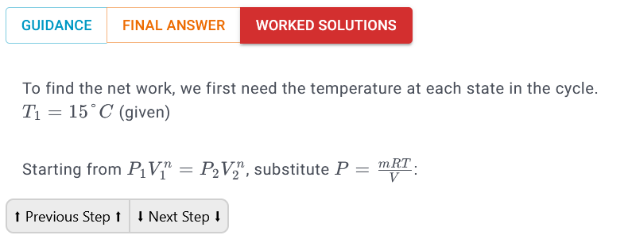

# Answering Questions

## Overview

The main view of a question is divided into two parts. The top half contains content that is relevant to the whole question,
and the bottom half contains content for each individual part. Additionally, the part content may include one or more 
[response areas](response_areas.md). When you think you have answered the question, enter your answer into the response area, if
it exists, and press the "Check" button to check your work. If you are correct, the question will be marked as "done".
If there is no response area (e.g. for a "show that..." question), you can manually mark the question as done using the box at the bottom right.

## Answers and Worked Solutions

If you are stuck, you can view worked solutions using the "Worked Solutions" option on the bottom ribbon. The steps in the solution are
revealed step-by-step, so you should avoid the temptation to look at the whole solution at once, and try to complete as much as possible
independently. 

You can also view the answer to each question using the "Final Answer" option on the bottom ribbon. This contains the 
answer only, with no intermediate results or working.

It is important that you always make your own genuine attempt to solve each problem before resorting to the final answers or the worked solutions. To help encourage this, a warning will appear if you try to access help before a question-specific time limit has elapsed.
