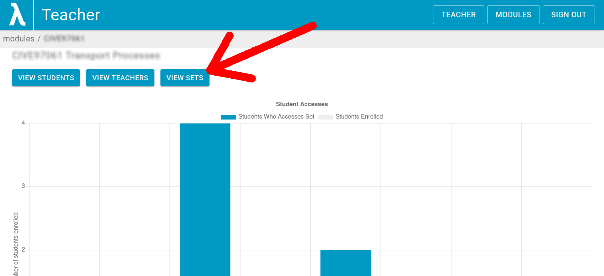
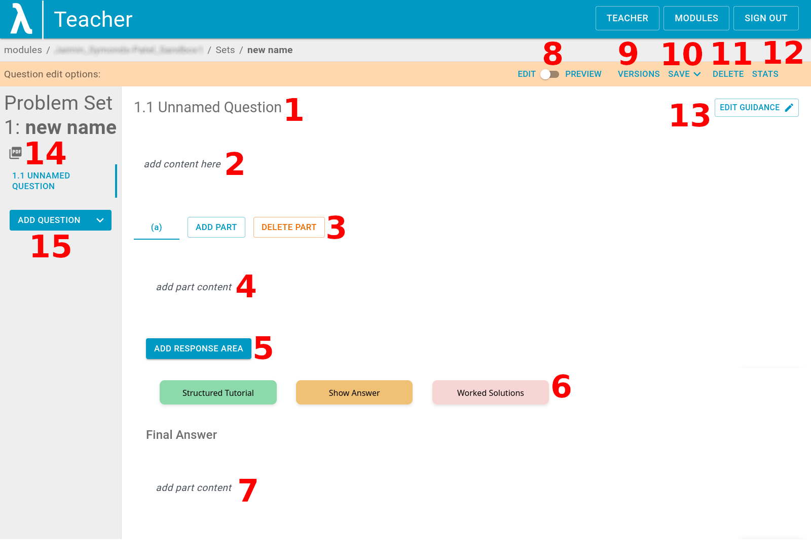

# Content Creation - Sets and Questions
In this guide, we will walk through how to create [sets](https://lambda-feedback.github.io/Documentation/intro/terminology/#sets) and [questions](https://lambda-feedback.github.io/Documentation/intro/terminology/#questions).

## Creating Sets
1. Upon first logging in to Lambda Feedback, we are met with a list of all of our modules. This gives us access to our modules as if we were a student, however, we want access to the modules which we ourselves have created as teachers. Thus, we must switch to the "Teacher" panel.

    

2. Once we are in the "Teacher" panel, we can select the module we wish to edit.

    

3. We then enter the module's panel. Here, we can access the list of students and teachers who have access to that module. We may also see some statistics for the module below the three main buttons, showing how many have accessed the sets within that module. But what we are interested in are the sets, and so we would select the "VIEW SETS" button.

    

4. We then are presented with all the sets within the module we selected. If this is a new module, then there will be no sets. In order to create a set, we want to click on the "CREATE SET" button.

    

5. If we create a new set, it will appear within our list of sets as an unnamed set. The first thing we want to do is to edit the name of our set by clicking on the "EDIT SET METADATA" button. Furthermore, we are able to hide it from the view of students by toggling it to be "Manually Hidden", and delete it with the bin icon.

    

6. The metadata which we can edit consists of the name of the set, a description, a release date, and a hide date.

    

7. Once done editing, hit the "SUBMIT" button. We are then taken back to the list of our sets, but with our changes made.

    

To create more sets, we just need to repeat this process.

## Creating Questions
1. Once we have successfully created the sets we want, we want to click on it in order to edit or add questions.

    

2. When we select a set, we are taken to the question dashboard, where we can access the questions of the set and edit them. There are many options, and so they are shown and listed below.

    

    | Label | Name | Description |
    | --- | --- | --- |
    | 1 | Question Name | Here we can edit the name given to the question |
    | 2 | Question Content | It is worth noting that all questions are governed by the framework 'Question + Part'. And so, this question content box is the main content (if more than one part), or the whole content of the question (if only one part, where the part content is empty). |
    | 3 | Part Editing Options | Here we can select/edit, create, or delete a part. |
    | 4 | Part Content | Here we can edit the specific content of the part (the sub question). |
    | 5 | Response Area | This is the means by which the student answers a given question. It is optional to include a response area. |
    | 6 | Question Help Options | Here we may add a [Structured Tutorial](https://lambda-feedback.github.io/Documentation/intro/terminology/#structured-tutorial), a [Final Answer](https://lambda-feedback.github.io/Documentation/intro/terminology/#final-answer) ("Show Answer"), or [Worked Solutions](https://lambda-feedback.github.io/Documentation/intro/terminology/#worked-solution). These buttons are also how the student will see them, hence the name of "Show Answer". |
    | 7 | Question Help Content | Here we can click on any of the buttons for the type of help option, and input the content of that option. |
    | 8 | Teacher-Student View Toggle | Here we may toggle between the teacher view ("EDIT"), and the student view ("PREVIEW"). This way we can edit the question, but also see a preview of how it would look to the student. |
    | 9 | Version Options | Here we can obtain some version control, and view earlier edits/versions of the question. |
    | 10 | Save Options | Here we can save the question in various ways. Firstly, we can save a new version, but not publish (so the student cannot see this new version). Secondly, we can save a new version, and publish (so the student sees this new version). Lastly, we can revert to a previously publish version. |
    | 11 | Delete | Here we can delete the question. |
    | 12 | Statistics | Here we can view statistics for the specific question such as how many have attempted a certain part. |
    | 13 | Edit Guidance | Here we can add information such as difficulty, expected time to spend, and a brief bit of general guidance for the question. |
    | 14 | PDF Export | Here we (and students) can export the questions in PDF format for use offline. |
    | 15 | Add Question | Here we can add a new question, which would contain all the options discussed above. |
