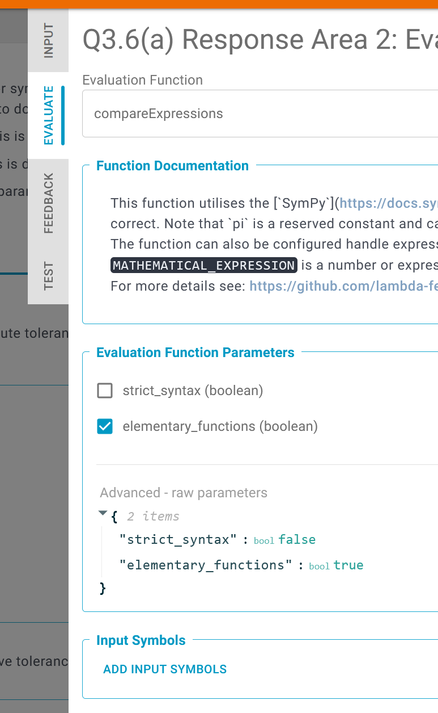
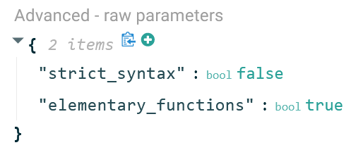
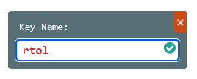
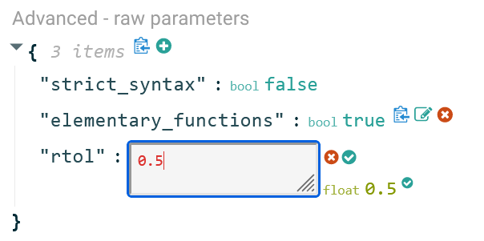
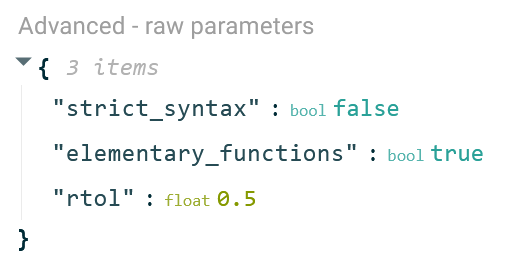

# Frequently Asked Questions

## How can I enroll students on my new [Module](../../terminology.md#modules)

Students and users are given access to a module using their college email address (from microsoft).

1. Login and navigate to your [**Teacher**]({{ urls.client }}/teacher/modules) dashboard
2. Select the module on which you want to enroll students
3. When on the module page, click the **View Students** button
4. Enter the enrolment page by clicking the **Entroll Students :material-plus:** button
5. Enroll students by supplying one or more student email addresses

## How can I move questions between problem sets?

When creating a new question the teacher can choose to "clone" from an existing question. The teacher can then delete the original version.

1. In the problem set you wish to move the question to, select the **v** symbol to the right of the **Add Question** button
2. From the dropdown menu, select **Clone From Question**
3. Select the title of the question you wish clone from the list that appear
4. If you wish, go back and delete the question from its original location

## How can I set parameters for evaluation functions?

The most common parameters will be visible uder the **EVALUATE** tab in the configure panel.

If there is a parameter that is not already visible it can be set using the **Advanced - raw parameters** (also under the **EVALUATE** tab) by doing the following:

1. Hover over the list of parameters in the **Advanced - raw parameters** area. Click the green plus-symbol that appears.

2. Type the name of the parameter (without quotation marks).

3. Hover over the box that says `NULL` next to the newly added parameter. Click the green pen symbol that appears to the right of it.

4. Type in the desired value in box that appears. By default it will be assumed that the parameter value is a string. The webclient will infer other possible types based on the written input. If the setting should be a string, click the green checkmark to the top right, and if you want the inferred type click the green checkmark at the bottom right.

5. The parameter is now set.

## How do I reorder questions?

It is only possible to reorder published questions in a set. This prevents inadvertently inserting new questions between two published ones. This ensures consistency to the student when viewing a published set as existing questions will remain in an unchanged order, with new questions being added to the bottom (unless manually changed by the teacher). You can tell a question is unpublished as it will take the '**1.X**' numbering format

To reorder questions:

1. Publish the questions you wish to reorder using **FILE** > **SAVE AND PUBLISH** (alternatively click on the **PUBLISH WHOLE SET** button)
2. Refresh the page
3. Drag and drop the questions into the new order
4. Ensure the green box pops up saying: 'questions reordered successfully' - there is no need to republish the set
