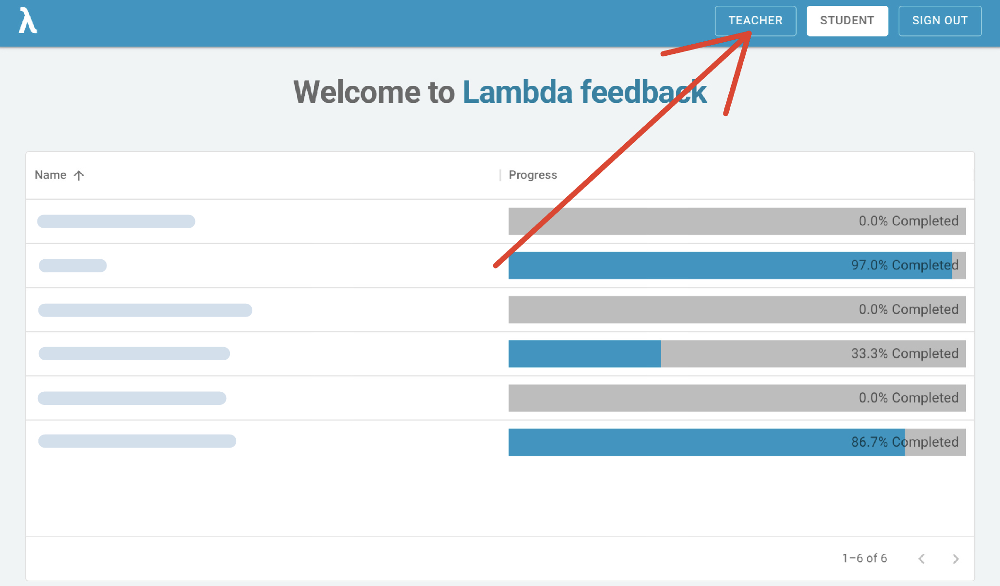
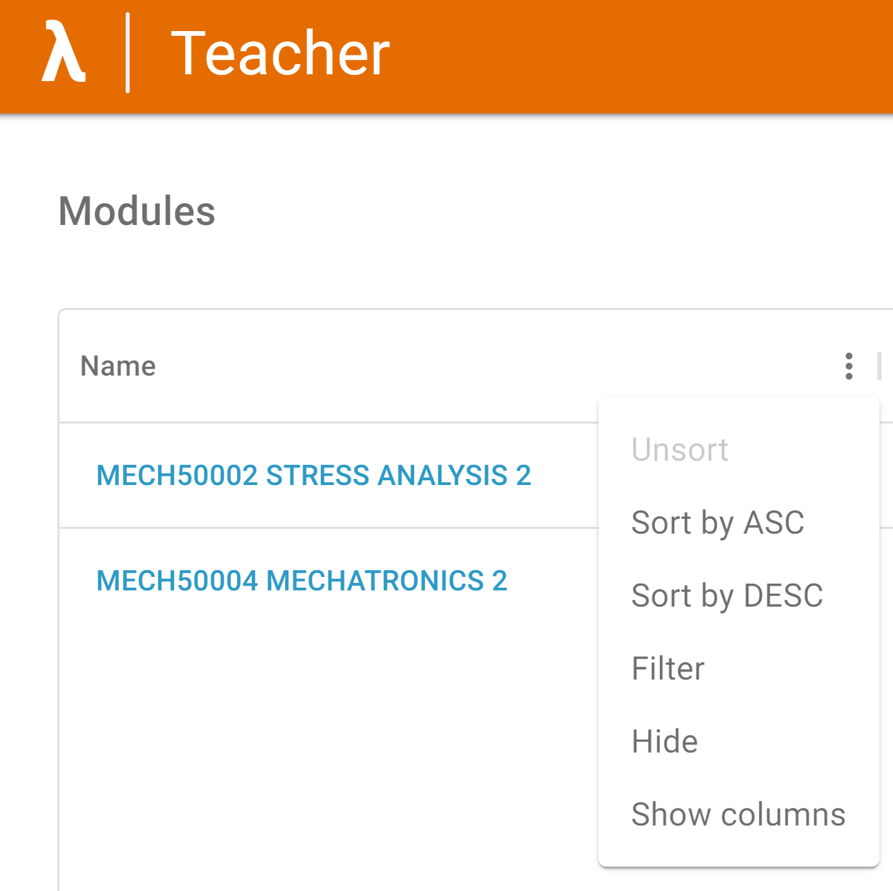

# Get started as a teacher using Lambda Feedback

## Access a module

Use your Imperial Microsoft account to sign in and access your modules. By default you are logged in as a student and the interface will be blue. If you have teacher priviliges then you will see a teacher button at the top.

 

To enter teacher mode, <ins>click on the Teacher button</ins>, and the colour of the interface will change to orange. This is where you are able to access all your modules, as well as upload and edit problem sets.

As of 07/2023, new modules can only be added to Lambda Feedback by administrators. Please speak to an admin if you wish for your module to be added to the website.

 

To find the module you want, you can sort ASCENDING as per the image below: 
{: style="height:200px"}
{: style="height:200px"} 
_Image: quick sort (left) or filtering (right)_

As of 31/8/22 the filtering/sorting only works on the content visible on the current page (other pages are ignored). We aim to fix this by sorting at the backend.

Select the module you wish to edit. 

## Create a new problem set

<ins>Click on your module</ins> and then <ins>click on "view sets"</ins> (upper left-hand corner). 

Create a new set by pressing the button seen below and this will automatically appear with a default name which you can edit by clicking 'edit set metadata': 
{: style="height:50px"}

To edit the content, <ins>click on the set name</ins>. This will open the Set in a ['WYSIWYG'](https://en.wikipedia.org/wiki/WYSIWYG) editor. The first question is automatically created with a default name.

The question structure is described [here](../../student/index.md).

## Below the line

Below the main question content you can provide high quality support material for students.

{: style="height:50px"}

A [student guide is here](../../student/index.md) and teachers use the content as follows:

- **Structured tutorial** is a canvas to provide scaffolding to students struggling with the question.
- **Final answer** is self explanatory.
- **Worked solutions** provides detailed, step-by-step solutions.

All content below the line uses milkdown functionality. Worked solutions can be branched. Future developments will add branching and response areas to structured tutorials.

It is not necessary to include all three methods of help, if only one of the tabs is filled then only that one button will be included in the published student version.

For general terminology, see [here.](../../terminology.md)

To see further details on how to edit your questions, see [here.](content-sets-questions.md)

## Enrolling students

In TEACHER mode, open your module home page and click 'VIEW STUDENTS' then 'ENROL STUDENTS'

 

Enter a comma-separated list of email addresses. Press 'Enter' to confirm the addresses, and then 'SUBMIT' to enrol the students

### Imperial College London email addresses

You must use the long form email address:

#### Valid:

first.nameYY@imperial.ac.uk (student)
j.doe@imperial.ac.uk (staff)
first.name@imperial.ac.uk (staff)

#### Invalid

abc123@ic.ac.uk
abc123@imperial.ac.uk
user@ic.ac.uk
user@imperial.ac.uk
first.nameYY@ic.ac.uk

The reason for the above is because we use Azure Active Directory - i.e. Microsoft - to authorise users.
