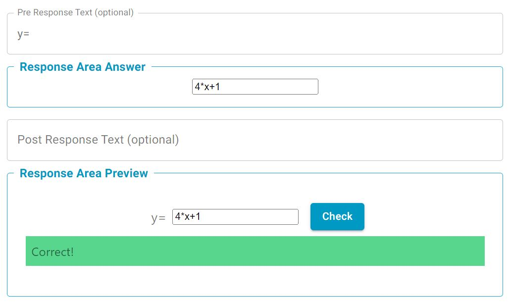

# Expression

This response area is very similar to [Text](Text.md), differing in that it can display how the user's response was interpreted back to them through the 'live preview' feature. This works using the grading function, providing a `feedback.response_latex` field, which gets rendered.

## Evaluation Function Options

### `isSimilar`

Calculates the difference between the teacher answer (ans) and the student response (res); compares this to an allowable difference comprising an absolute tolerance (atol) and a relative tolerance (rtol).

### `symbolicEqual`

Compares two symbolic expressions for mathematical equivalence, using SymPy. See [SymPy](https://www.sympy.org/en/index.html.md-button) for further information.

## Component Parameters

### `post_response_text` (optional)

Text block to be displayed to the left of the input field. Markdown and LaTeX are allowed following the usual syntax.

### `pre_response_text` (optional)

Text block to be displayed to the left of the input field. Markdown and LaTeX are allowed following the usual syntax.

### Allow Handwrite (Experimental)

Enables a handwriting canvas in the browser, which allows a student can use to draw their expression, rather than type using Sympy's syntax.

### Photo (Experimental)

Allows a student to upload their expression as an image, as an alternative to handwriting if the student isn't using a phone or tablet.

## Setting The Answer

Type the correct answer into the 'Response Area Answer' using standard syntax. As the student enters the answer, this will be rendered using the 'live preview' feature, to ensure the correct expression has been entered.

Use the 'Response Area Preview' to check the answer has been set correctly.

## Example Student Response area

Correct response given

Incorrect response given

